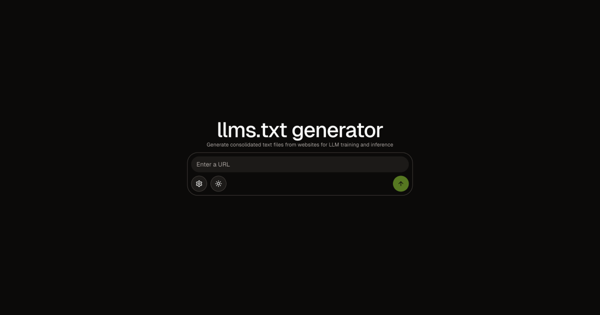

# `llms.txt`



https://github.com/user-attachments/assets/2ce04936-d18a-4148-8c82-25bbc306f608

## Project Overview

`llms.txt` is a web application for generating consolidated text files from websites, designed for Large Language Model training and inference. It produces:
- `llms.txt`: An index of site pages with AI-generated titles and descriptions.
- `llms-full.txt`: The full plain text content of all crawled pages.

The project uses [Firecrawl](https://www.firecrawl.dev/) for crawling/scraping and [OpenAI](https://platform.openai.com/) for generating titles and descriptions.

## Technologies

- [Next.js 15](https://nextjs.org/)
- [React 19](https://react.dev/)
- [TypeScript 5+](https://www.typescriptlang.org/)
- [TailwindCSS 4](https://tailwindcss.com/)
- [Shadcn/UI](https://ui.shadcn.com/)
- [@mendable/firecrawl-js](https://www.npmjs.com/package/@mendable/firecrawl-js)
- [OpenAI](https://platform.openai.com/) via [@ai-sdk/openai](https://www.npmjs.com/package/@ai-sdk/openai)
- [ai](https://www.npmjs.com/package/ai)

## Prerequisites

- Node.js >= 20
- [pnpm](https://pnpm.io/) (**recommended**)

### API Key Configuration

- **Firecrawl**: Get your key [here](https://www.firecrawl.dev/app/api-keys). Provide it in the UI (Settings) or in a `.env` file at the project root (`FIRECRAWL_API_KEY`).
- **OpenAI**: Set your key in `.env` (`OPENAI_API_KEY`) or export it in your shell.

Example `.env` file:
```env
FIRECRAWL_API_KEY=fc-...
OPENAI_API_KEY=sk-...
```

## Installation

1. Clone the repository and install dependencies:
   ```bash
   pnpm install
   ```
2. Add your API keys to the `.env` file at the project root (see previous section).
3. Start the development server:
   ```bash
   pnpm dev
   ```
   The app will be accessible at [http://localhost:3000](http://localhost:3000).

## Usage

1. Enter the website URL to crawl in the input field.
2. Make sure your API keys are configured (see Settings or `.env`).
3. Start the generation and monitor progress.
4. Download the generated files (`llms.txt`, `llms-full.txt`).

## Customization

- Maximum number of URLs to crawl is configurable in the UI.

## Resources

- [Firecrawl Documentation](https://docs.firecrawl.dev/)
- [AI SDK OpenAI](https://ai-sdk.dev/providers/ai-sdk-providers/openai)
- [Next.js Documentation](https://nextjs.org/docs)
- [Shadcn/UI Documentation](https://ui.shadcn.com/docs)

---

© 2025 - Open source project under the MIT license.
